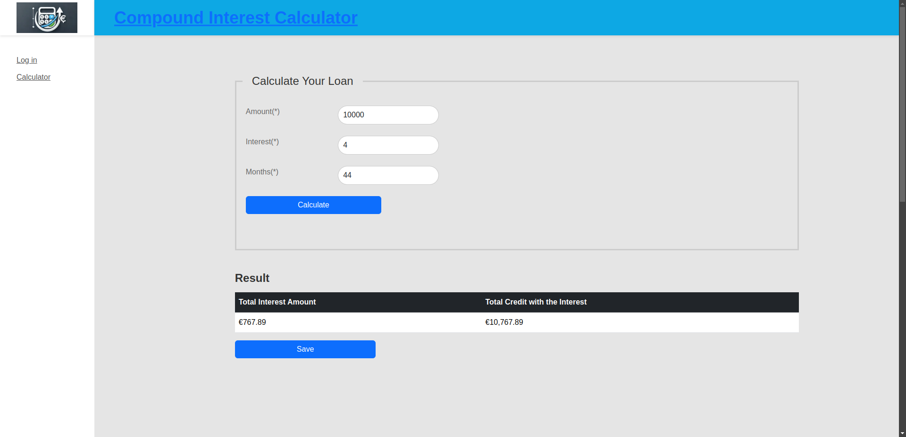

# FrontendInterestCalculator

This project was generated with [Angular CLI](https://github.com/angular/angular-cli) version 18.0.7.

## Development server

Run `ng serve` for a dev server. Navigate to `http://localhost:4200/`. The application will automatically reload if you change any of the source files.

This repository, gergefis-frontend-interest-calculator, is the frontend codebase for an Interest Calculator Application developed with Angular. Its primary purpose is to provide a user-friendly interface to calculate interest rates and display related financial data. Below is a detailed breakdown of its functionality based on the directory structure:

## Key Features and Purpose

1. ### Interest Calculation
* The app implements logic for interest calculations, likely involving user-provided data (e.g., principal amount, rate, and duration).
*Related logic is defined in reusable TypeScript files like calculator.ts.

2. ### User Interface Components
* **Header, Footer, Navbar**: These components structure the page layout.
* **Calculator Component**: Main user interaction area for inputting data and triggering calculations.
* **Result Component**: Displays calculated interest or related data.
* **Offer List**: Likely shows available interest offers or plans.
* **User Register Component**: Handles user registration, possibly to save preferences or history.

3. ### Modular Design

* The codebase is structured to separate reusable business logic (***common/***), services (***services/***), and validations (***validators/***) from UI components (***components/***).
* This modularity improves maintainab

4. ### Services

* **Calculator Service**: Encapsulates core calculation logic.
* **Calculator Data Service**: Likely facilitates communication between components or handles external data fetching.

5. ### Validators

* Custom validation, like ensuring input is free of unnecessary whitespace, is implemented in the ***validators/*** folder.

6. ### Assets

* Stores static resources like the application logo for branding purposes.

7. ### Testing

Comprehensive test files (***.spec.ts***) #0a192f ensure quality and correctness for both logic and UI components.

## Audience
The application is likely aimed at:

* **Individual Users**: To calculate loan interest, savings growth, or other financial metrics.

## Summary
This repository combines clean design, reusable components, and robust functionality to deliver a fully-featured interest calculator frontend.

1. ### Add  your details

2. ### Calculate

3. ### Find your personal saved offers (only for registered users)
